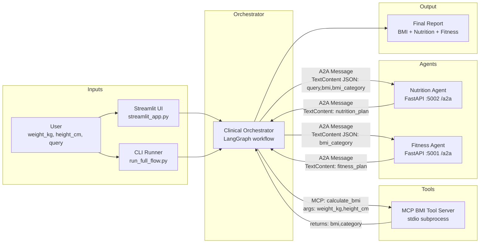

# clinicalanalyst_agent2agent
Clinical Agent System (A2A + MCP)  A minimal multi-agent system where a **Clinical Orchestrator** computes BMI via an **MCP tool server**, then delegates to two **A2A agents**:  - **Nutrition Agent**: returns 2 recipe options (each with 10 steps) - **Fitness Agent**

## Data Flow Architecture



### What moves between components

**1) User input**
- Provided via CLI or UI:
  - `weight_kg` (float)
  - `height_cm` (float)
  - `query` (string)

**2) Clinical → BMI tool (MCP)**
- The Clinical agent spawns the MCP BMI server as a local stdio subprocess and calls:
  - tool: `calculate_bmi`
  - args: `{ "weight_kg": ..., "height_cm": ... }`
- Returns structured output:
  - `{ "bmi": <float>, "category": <str>, "units": "metric" }`

**3) Clinical → Nutrition agent (A2A)**
- Sends an A2A `Message` containing JSON inside `TextContent.text`:
  - `{ "query": <str>, "bmi": <float>, "bmi_category": <str> }`
- Nutrition replies with plain text:
  - exactly **2 recipes**, each with **Ingredients** and **Steps (10)**

**4) Clinical → Fitness agent (A2A)**
- Sends JSON inside `TextContent.text`:
  - `{ "bmi_category": <str> }`
- Fitness replies with plain text plan.

## Project Structure

- `app/agents/clinical_agent_main/clinical_agent.py` — LangGraph orchestrator
- `app/agents/clinical_agent_main/mcp_clients/bmi_client.py` — MCP stdio client (spawns BMI tool server)
- `app/shared_tools/bmi_mcp_server/server.py` — MCP BMI tool server (stdio)
- `app/agents/nutrition_agent/main.py` — A2A Nutrition FastAPI server
- `app/agents/fitness_agent/main.py` — A2A Fitness FastAPI server
- `streamlit_app.py` — simple UI for weight/height/query
- `run_full_flow.py` — CLI runner (prints final report + JSON)

## Run It

### 0) Setup

```powershell
python -m venv .venv
./.venv/Scripts/pip.exe install -r requirements.txt
```

### 1) Start agents (two terminals)

```powershell
./.venv/Scripts/python.exe app/agents/nutrition_agent/main.py
```

```powershell
./.venv/Scripts/python.exe app/agents/fitness_agent/main.py
```

### 2) Run the full flow via CLI

```powershell
./.venv/Scripts/python.exe run_full_flow.py --weight-kg 85 --height-cm 175 --query "beans and rice" --no-servers
```

Tip: omit `--no-servers` to let the runner start Nutrition/Fitness automatically.

### 3) Run the UI

```powershell
./.venv/Scripts/python.exe -m streamlit run streamlit_app.py
```

Open: http://localhost:8501

## Configuration

Environment variables (optional):

- `NUTRITION_AGENT_URL` (default `http://localhost:5002/a2a`)
- `FITNESS_AGENT_URL` (default `http://localhost:5001/a2a`)
- `OPENAI_API_KEY` (Nutrition agent uses it if set; otherwise a strict fallback format is returned)
- `OPENAI_MODEL` (default `gpt-4o`)
- `TAVILY_API_KEY` (Fitness agent uses it if configured)

## Notes

- A2A messages are exchanged as JSON payloads embedded in `TextContent.text`.
- The BMI tool is an MCP server run locally via stdio (no HTTP) and called by the Clinical orchestrator.
